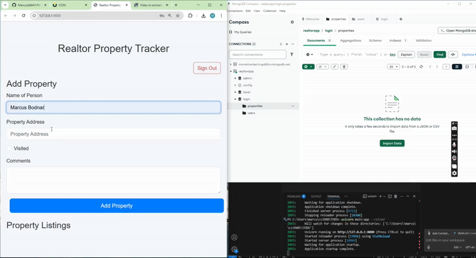

# Realtor Property Tracker

## Project Description
The **Realtor Property Tracker** is a web application designed to help potential buyers track properties they are interested in. Users can add new properties, mark properties as visited, and add comments to the listings. It also allows the deletion of properties no longer of interest.

## Features
**User Authentication** Secure signup and login system with JWT tokens
**Property Management** Add, edit, and delete property listings
**Visited Status**  Track which properties have been visited
**Comments** Add notes or comments about each property
**Persistent Storage** All data stored in MongoDB
## Technologies Used
- **Frontend**: HTML, CSS, JavaScript, Bootstrap
- **Backend**: FastAPI - Web Framework, Beanie - Mongodb ODM, PyJWT - Token handling
- **Data Storage**: MongoDB - Document Database



## Installation and Setup

### Prerequisites
Make sure you have Python installed on your system. You will also need to set up a virtual environment for this project.

### Setting up the Project
1. Clone the repository to your local machine:
   ```bash
   git clone https://github.com/Marcusb8441/NEWTODO.git

2. Navigate to directory
    cd NEWTODO

3. Create a virtual environment 
    python -m venv venv

4. Activate the VENV
    Windows- venv\Scripts\activate
    Mac- source venv/bin/activate

5. Install dependencies 
    pip install -r requirements.txt

6. Set up MongoDB
- Create a MongoDB database named "login"
- Update the connection string in database.py if needed

4. **Run the application**:
### Running the App
1. Start the FastApi backend
     uvicorn main:app --reload

2. Open the index.html in the frontend folder
